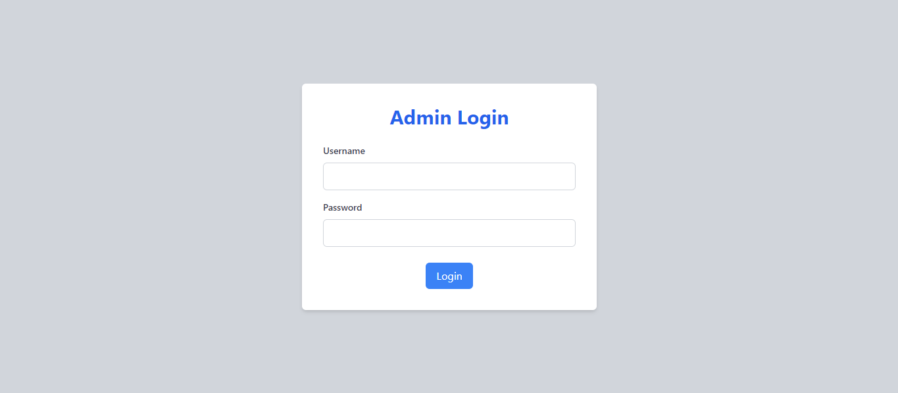
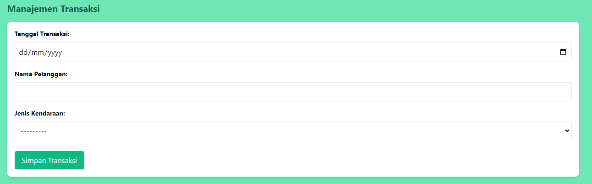
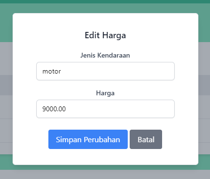
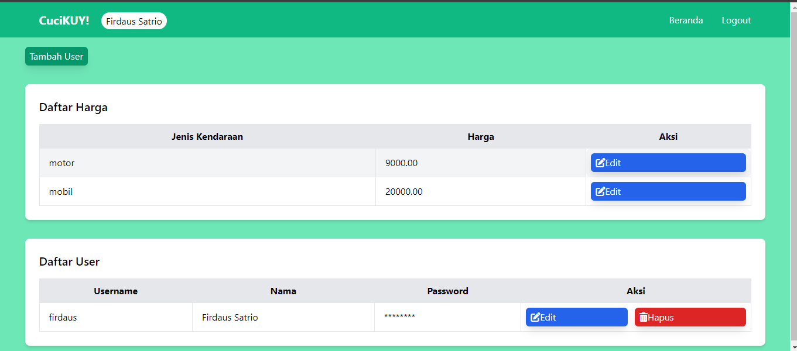
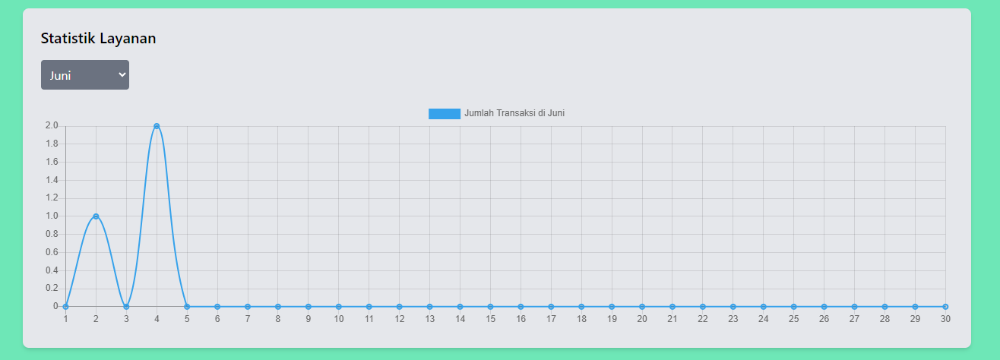
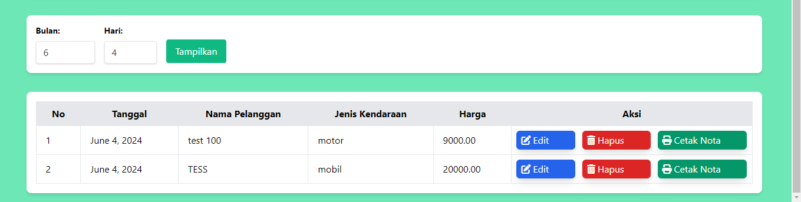
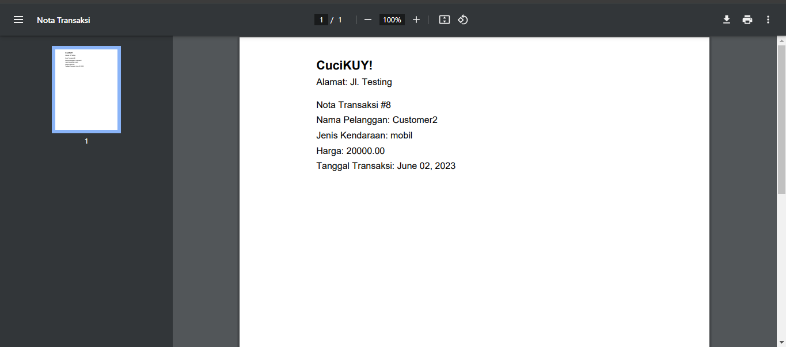
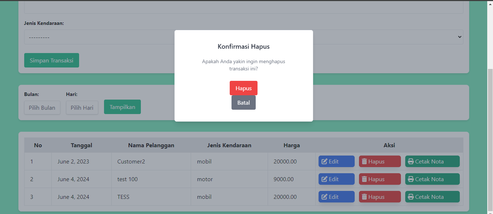

# CuciKuy 🚗🛵

Selamat datang di repository **CuciKuy**, sebuah sistem manajemen yang elegan dan efisien untuk layanan cuci kendaraan. Proyek ini dirancang khusus untuk memudahkan pengelolaan data transaksi dan pelanggan di tempat cuci kendaraan.

## 🌟 Tentang Proyek
**CuciKuy** adalah solusi lengkap untuk kebutuhan manajemen cuci kendaraan Anda. Dikembangkan oleh mahasiswa untirta sebagai bagian dari Tugas UAS MK Bahasa Pemrograman II, proyek ini menawarkan serangkaian fitur canggih yang hanya dapat diakses oleh admin. Dari mengelola transaksi hingga pembaruan data admin, **CuciKuy** memastikan semua kebutuhan Anda terpenuhi dengan efisien dan efektif.

### 🛠 Fitur Utama
- **Manajemen Transaksi**: Input, edit, hapus, dan cetak nota transaksi.
- **Filter History Transaksi**: Tampilkan history transaksi berdasarkan bulan dan tanggal.
- **Manajemen Data Master**: Kelola data harga per kendaraan dan pengaturan admin.
- **Logout**: Keluar

### 👥 Anggota Kelompok
- **Firdaus Satrio Utomo (3337230039)**
- **Sirrul Fatih Ahdiat (3337230050)**
- **Nurul Santi Hafifah (3337230019)**

## 📖 Daftar Isi
- [Instalasi](#-instalasi)
- [Cara Menggunakan](#-cara-menggunakan)
- [Screen Shoot Halaman](#-screenshot-halaman)
- [Kontribusi](#-kontribusi)
- [Lisensi](#-lisensi)

## 💽 Instalasi
Untuk memulai dengan **CuciKuy**, ikuti langkah-langkah berikut di lingkungan lokal Anda:

```bash
git clone https://github.com/firdausuntirta/CuciKuy.git
cd CuciKuy
pip install reportlab
python manage.py runserver
```
📝NOTE: Gunakan Username "firdaus" dan Password "Oke12345" jika anda belum membuat user

ℹ️ untuk menambahkan user bisa menggunakan command dibawah ataupun bisa di website **jika sudah ada usernya**
```bash
python tambah_user.py
```


## 📚 Cara Menggunakan
Setelah instalasi, Anda dapat login sebagai admin untuk mengakses semua fitur manajemen bisa dilihat pada [Screenshot Halaman](#-screenshot-halaman). Jika belum ada user , anda bisa gunakan username bawaan yaitu **firdaus** dan passowrdnya **Oke12345** selamat mencoba dan semoga berhasil. 


## 📸 Screenshot Halaman
Berikut adalah beberapa screenshot yang menunjukkan berbagai halaman penting dalam sistem **CuciKuy**. Screenshot ini memberikan gambaran tentang antarmuka pengguna dan beberapa fitur utama yang tersedia.

### Login Page
Halaman login memungkinkan pengguna untuk masuk ke sistem. Gunakan username dan password yang diberikan untuk mengakses fitur admin.


### Tambah Transaksi
Di halaman ini, pengguna dapat menambahkan transaksi baru untuk layanan cuci kendaraan.


### Edit Harga Form
Halaman ini digunakan oleh admin untuk memperbarui harga layanan yang tersedia dalam sistem.


### Data Master Page
Halaman ini digunakan untuk mengelola informasi dasar atau data master seperti data pengguna, harga, dan pengaturan lainnya.


### Statistik Layanan Bulan
Halaman ini menampilkan statistik layanan per bulan, memudahkan pengguna untuk melihat dan menganalisis tren transaksi.


### Filter Berdasarkan Tanggal Page
Halaman ini menyediakan fungsi untuk menfilter dan menampilkan transaksi berdasarkan tanggal tertentu.


### Cetak Nota Page
Setelah transaksi selesai, halaman ini digunakan untuk mencetak nota sebagai bukti transaksi yang telah dilakukan.


### Hapus Transaksi Page
Halaman ini memungkinkan admin untuk menghapus transaksi yang tidak diinginkan atau salah input dari sistem.


ℹ️ **Foto halaman lain dapat diliat di folder [assetsgithub](https://github.com/firdausuntirta/CuciKuy/tree/main/assetsgithub)**

## 🤝 Kontribusi

Kami mengundang kontribusi untuk membuat **CuciKuy** lebih baik. Jika Anda ingin berkontribusi, silakan fork repository ini dan submit pull request Anda.

## 📜 Lisensi

Proyek ini dilisensikan di bawah [MIT License](LICENSE).

